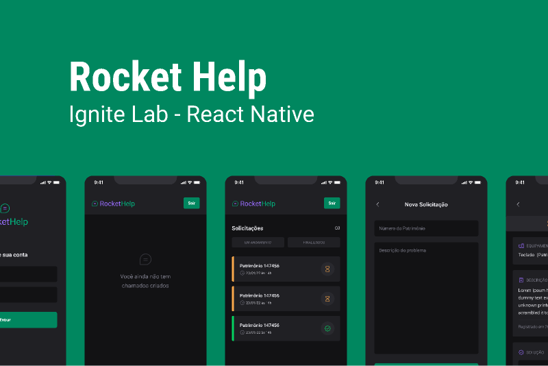

<h1 align="center">Ignite Lab de React Native - Rocket Help 🚀 </h1>

<h4 align="center"> 
	  Status: Concluido 🚀 
</h4>

<br />

<p align="center">Nesse desafio desenvolvemos uma aplicação para automatizar os registros de suporte referente ao setor de TI de uma empresa.</p> 

<br />
<p align="center">  </p>
<br />


<br />

## Funcionalidades

- Autenticação,
- Armazenamento e atualização  de dados em tempo real,
- Cadastro e encerramento de suporte,
- Filtro de acordo com o status do suporte (em andamento ou finalizado).

<br />

## Pré-requisitos

Antes de começar, você vai precisar ter instalado em sua máquina as seguintes ferramentas:
[Git](https://git-scm.com), [Node.js](https://nodejs.org/en/) e [Android Studio](https://developer.android.com/studio?gclid=Cj0KCQjwuO6WBhDLARIsAIdeyDIcH0KtNOLkHHAQB5wcV-NHXBhXuDMKKrs2e6HnJqy8N91d4WDHdFkaAi8MEALw_wcB&gclsrc=aw.ds) ou ter instalado o aplicativo do **Expo** em seu smartphone.
Além disto é bom ter um editor para trabalhar com o código como [VSCode](https://code.visualstudio.com/)

<br />

##  Tecnologias

As seguintes ferramentas foram usadas na construção do projeto:

<p align="center">
  
  
  
  
</p>

<br />

## Layout

Você pode visualizar o layout do projeto através [desse link](https://www.figma.com/file/eVwWfTJ8TZH9h08UsfTIbX/Rocket-Help-Ignite-Lab-Community). É necessário ter conta no [Figma](http://figma.com/) para acessá-lo.

<br />

### Instalação e Execução do Projeto

- Clone este repositório

```
> git clone https://github.com/daygorgonha/rockethelp.git
```

- Navegue até o diretório principal do projeto

```
> cd rockethelp
```

- Instale as dependências com o Yarn

```
> yarn
```

- Execute o projeto

```
> expo run:android
```

<br/>


---

<div align="center">
  <br />
  <a href="https://github.com/daygorgonha">
    
    <br />
    <small>Feito com ❤️ by <a href="https://www.linkedin.com/in/dayanegorgonha/">Dayane Gorgonha</a></small>
  </a>
</div>